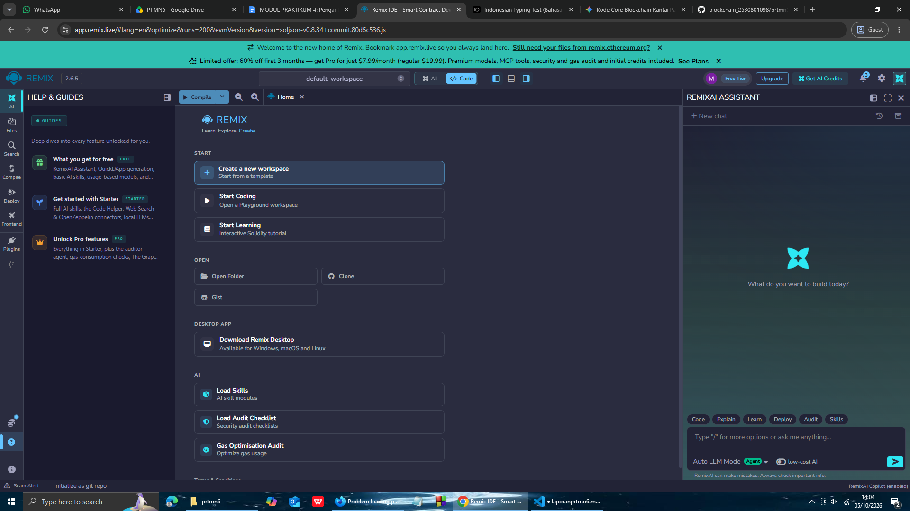
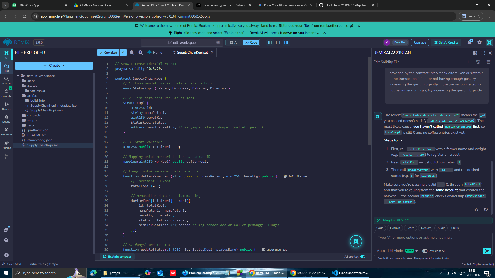
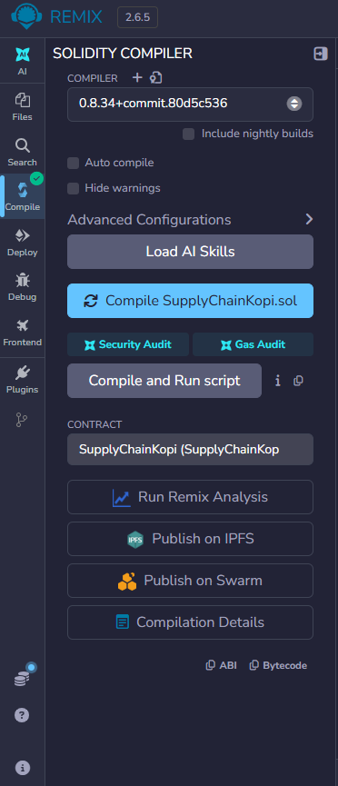
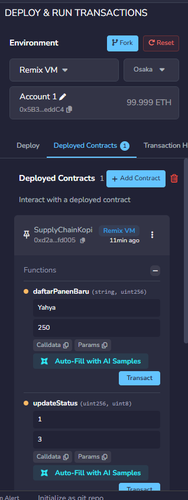
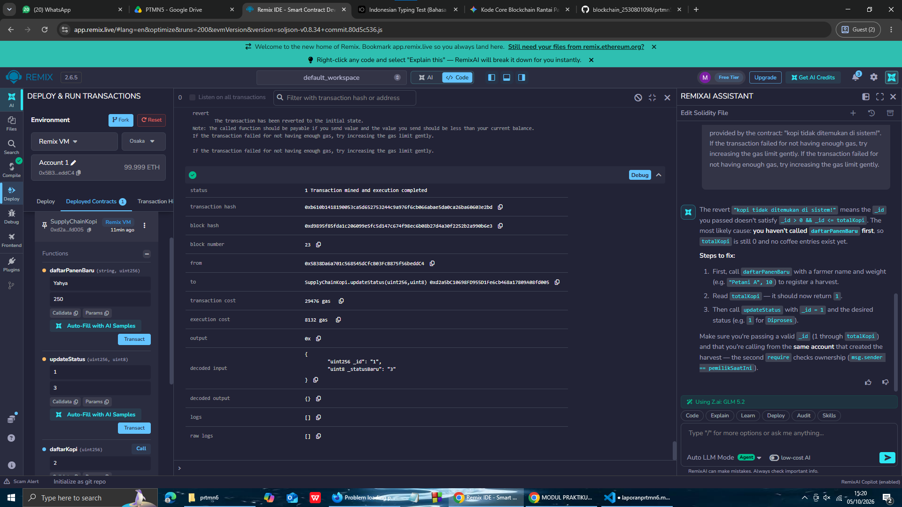

# Praktikum 6: Membuat Smart Contract dengan Solidity di Remix

## Tujuan pembelajaran

Setelah menyelesaikan Praktikum ini, mahasiswa diharapkan mampu:

1. memahami konsep dasar dari smart contract pada blockchain.
2. Menggunakan platform Remix untuk untuk menulis, mengompilasi, dan men-deploy smart contract berbasis Solidity.
3. Mengimplementasikan fungsionalitas dasar smart contract yang melibatkan state variable dan fungsi.
4. Melakukan interaksi dengan smart contract yang sudah ter-deploy melalui Remix.

### Proses Praktikum

1. Buka [Remix IDE](https://remix.ethereum.org/) login via Gmail, Bukti: 
2. Buat file baru bernama **SupplyChainKopi.sol** 
3. Compile 
4. Deploy 
5. Status Baru 
